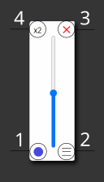

# Beoplay S3 Volume Control

This is an Electron app that allows direct control of volume, sleep and power for Beoplay s3 speakers using BLE. Works great if they are used as desktop/PC speakers but also usable if they are driven by another source. There are installers for Windows in the releases section. Builds for Mac and Linux can be made but aren't tested. 

## Example Speakers setup

Desktop is connected to a DAC. RCA / line-level outputs of the DAC are connected to the speakers. In a stereo setup, the L output has its own cable connected to one S3 aux input. Same goes for R output. May not work when the speakers are daisy chained to one another. 

# Using the APP

After a straightforward installation, an icon is added to the tray. If the speakers are switched on, the app will automatically attempt to connect at start-up. The app connects to as many speakers as it possibly can. So if you are an S3 overlord of some kind, switch off devices that don't need control. Click on the white s3 tray icon to open the following Pop-Up:

## Main Window

1. This button toggles sleep state of the connected speakers. When in sleep mode, the speakers are forced to sleep even after an audio signal wakes them up. This is useful when another audio device is to be used, like a headphone. (So basically a hard mute). Right clicking this button completely turns off the connected speakers. To use them again, they will have to be physically switched on.
2. Opens up the settings window. This is discussed in the next section.
3. This button completely closes the app and removes the tray icon.  
4. Display's the count of connected speakers.

## Settings Window

1. Launch at start-up : Basic toggle to auto launch the app with the system. The app begins searching for devices as soon as its loaded. So the speakers need to be switched on during start-up. If they weren't, the "Rescan and Reconnect" button can be used. 
2. Keep speakers awake : This forces the speakers to stay wake to combat s3's rather aggressive power management when using AUX connection. Its useful to enable this when audio content has lots of silent passages. Check the "Using the Repository" Section for more details on this.
3. Consume Media Volume Keys: When this is enabled "Volume Up" or "Volume Down" keys can be used to control the speaker level. Default system behaviour will be prevented.
4. Show Window while Changing Volume: When enabled controlling volume with media keys is complemented with visual feedback by briefly showing the main window.
5. Power off speakers on shutdown: This may work on Mac and Linux. For windows, [#24261](https://github.com/electron/electron/pull/24261)  needs to be addressed to be functional.
6. Scan Time: Adjust the duration to scan for available devices. Increase this if the speakers are not automatically connected at start-up
7. Rescan and Reconnect: This comes in handy when you want to do exactly this.
8. The console: Prints status messages and errors if any.

# Using the Repository

This repository can be used as a template to support other speakers(Check the src/web-app/profiles.js). For build settings and setting environment variables check build/build.js. 

To install dependencies: 

`npm install`

To start a development instance: 

`npm start`

To build:

`npm run build`

## How are the speakers kept awake?

The GATT characteristic "4446cf5f-12f2-4c1e-afe1-b15797535ba8" is the one that reports speaker sleep state. Interestingly this characteristic, only applicable to AUX connections,  is different from a higher level power management characteristic. The reported values are 1-0-0 for wake and 0-2-0 for sleep. (Three byte length). The values are reported reliably. The speaker goes into this sleep state after roughly 10 seconds of "AUX silence". It takes another 2 - 3 seconds for it to wake when it detects a signal. Ideally writing to this characteristic as soon as the state flips to 0-2-0 would keep the speaker awake. But, probably by design, only single bytes are allowed to be written here which makes it impossible to remotely wake the speaker. As an alternative the app plays out a 19khz sine wave for 500 milliseconds as soon as it detects a sleep event. It is mostly inaudible but can cause the speakers to make a faint "pop" or "click" sound.

